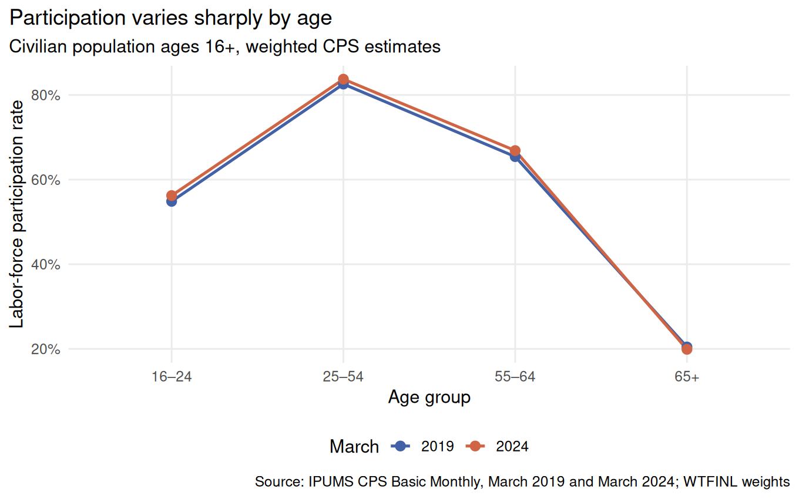
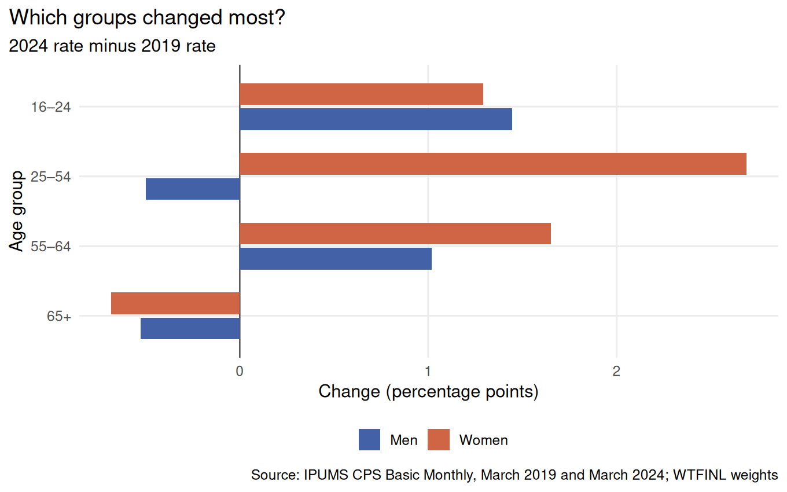
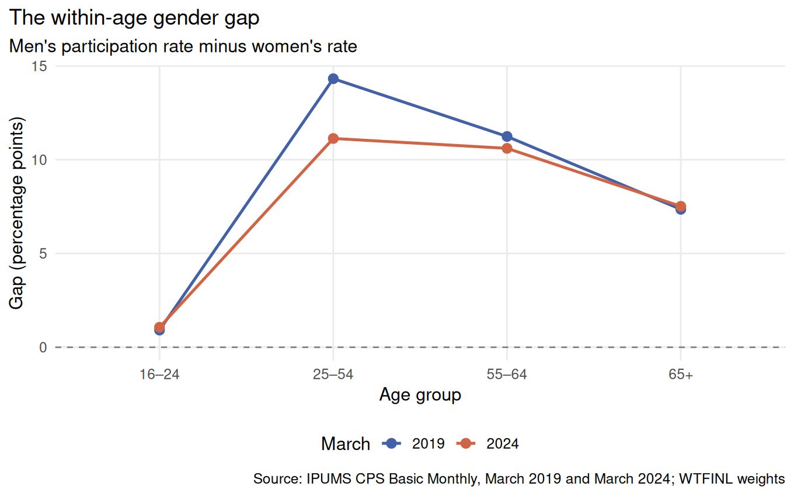

<style>
#quarto-document-content p {
  text-align: justify;
}
</style>

```{r}
#| include: false
overall <- read.csv("data/cleaned/weighted_age_rates.csv", check.names = FALSE)
changes <- read.csv("results/tables/changes_by_age_sex.csv", check.names = FALSE)
gaps <- read.csv("results/tables/gender_gaps.csv", check.names = FALSE)
rate_at <- function(table, yr, age_label) {
  value <- table$rate[table$year == yr & table$age_group == age_label]
  stopifnot(length(value) == 1L)
  value
}
gap_at <- function(yr, age_label) {
  value <- gaps$gap_pp[gaps$year == yr & gaps$age_group == age_label]
  stopifnot(length(value) == 1L)
  value
}
stopifnot(nrow(overall) == 8L, nrow(changes) == 8L, nrow(gaps) == 8L)
top_row <- changes[which.max(abs(changes$change_pp)), ]
top_group <- paste0(tolower(top_row$sex), " ages ", top_row$age_group)
top_change <- top_row$change_pp
```

## A changing labor market

In the aftermath of pandemic, was labor-force participation in 2024 back where it had been in 2019? A single national rate can hide different experiences among younger, prime-age, and older adults. Participation means having a job or actively seeking one; it is broader than employment. This post compares two March snapshots of the U.S. civilian population, then asks whether the changes look the same for women and men. The central finding is that the prime-age gain was concentrated among women, while participation among adults 65 and older was slightly lower.

## Data and method

I use person records from the [IPUMS Current Population Survey](https://cps.ipums.org/cps/), specifically the **March 2019 and March 2024 Basic Monthly Survey** samples. The analysis covers civilians ages 16 and older and divides them into four groups: 16–24, 25–54, 55–64, and 65+. The IPUMS labor-force-status field identifies people in the labor force. Each rate is the sum of the survey's monthly person weights for participants divided by the sum of these weights for everyone in the relevant group. Both dates use the same calendar month to avoid a simple month-of-year comparison problem.

## 1. Participation across ages



In March 2019, participation among adults ages 25–54 was `r sprintf("%.1f", rate_at(overall, 2019, "25–54"))`%; in March 2024 it was `r sprintf("%.1f", rate_at(overall, 2024, "25–54"))`%. The rates for ages 16–24 and 55–64 also rose, but the rate for ages 65+ moved from `r sprintf("%.1f", rate_at(overall, 2019, "65+"))`% to `r sprintf("%.1f", rate_at(overall, 2024, "65+"))`%. The lower participation level for older adults largely reflects the different life stage of retirement; the small change between dates is a separate question. The age pattern cautions against treating every group as if it moved with a single national average.

## 2. Where did rates move?



This chart subtracts each group's 2019 rate from its 2024 rate. Positive bars indicate higher participation in 2024; negative bars indicate lower participation. The largest absolute change among the eight age-by-sex groups was for `r top_group`, at `r sprintf("%+.1f", top_change)` percentage points. Prime-age men's rate, by contrast, fell by `r sprintf("%.1f", abs(changes$change_pp[changes$age_group == "25–54" & changes$sex == "Men"]))` points. Both sexes ages 65+ show small declines. The prime-age increase in the first chart therefore masks substantially different changes for women and men. These are **percentage-point** changes, not percent growth.

## 3. The gender gap within each age group



Here the gap equals the men's rate minus the women's rate *within the same age group*. A positive value therefore means higher participation among men. For ages 25–54, the gap narrowed from `r sprintf("%.1f", gap_at(2019, "25–54"))` points in 2019 to `r sprintf("%.1f", gap_at(2024, "25–54"))` points in 2024, a reduction of `r sprintf("%.1f", gap_at(2019, "25–54") - gap_at(2024, "25–54"))` points. The gap changed much less for ages 16–24 and 65+. The second chart explains the main narrowing: prime-age women's participation rose while men's edged down. This is a descriptive difference within age groups, not an estimate of unequal pay.

## What the three views tell us

The first figure establishes participation levels by age, the second locates the changes within age and sex, and the third reveals the resulting gender gaps. Together they show that a `r sprintf("%+.1f", rate_at(overall, 2024, "25–54") - rate_at(overall, 2019, "25–54"))`-point prime-age gain coincided with a `r sprintf("%.1f", gap_at(2019, "25–54") - gap_at(2024, "25–54"))`-point narrowing of the prime-age gender gap. The main takeaway is that the apparent prime-age recovery was disproportionately a women's participation story; it was not uniform across ages or sexes. These are two cross-sections. They do not track the *same individuals* or establish whether the pandemic, policy, or other factors caused the changes.

## Data Sources

- [IPUMS Current Population Survey (CPS)](https://cps.ipums.org/cps/): March 2019 and March 2024 Basic Monthly samples, accessed through IPUMS CPS.

<details>
<summary>IPUMS citation details</summary>

Sarah Flood, Miriam King, Renae Rodgers, Steven Ruggles, J. Robert Warren, Daniel Backman, Etienne Breton, Grace Cooper, Julia A. Rivera Drew, Stephanie Richards, David Van Riper, and Kari C.W. Williams. *IPUMS CPS: Version 13.0* [dataset]. Minneapolis, MN: IPUMS, 2025. [https://doi.org/10.18128/D030.V13.0](https://doi.org/10.18128/D030.V13.0).


</details>
