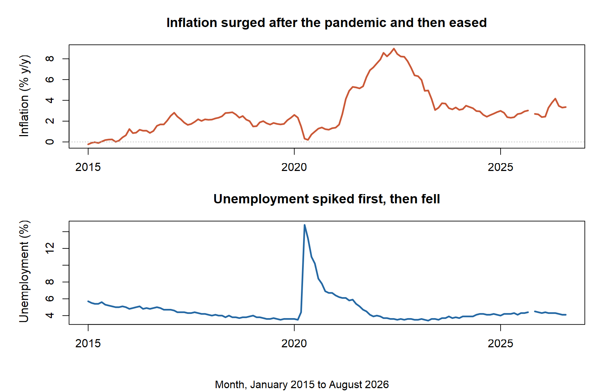
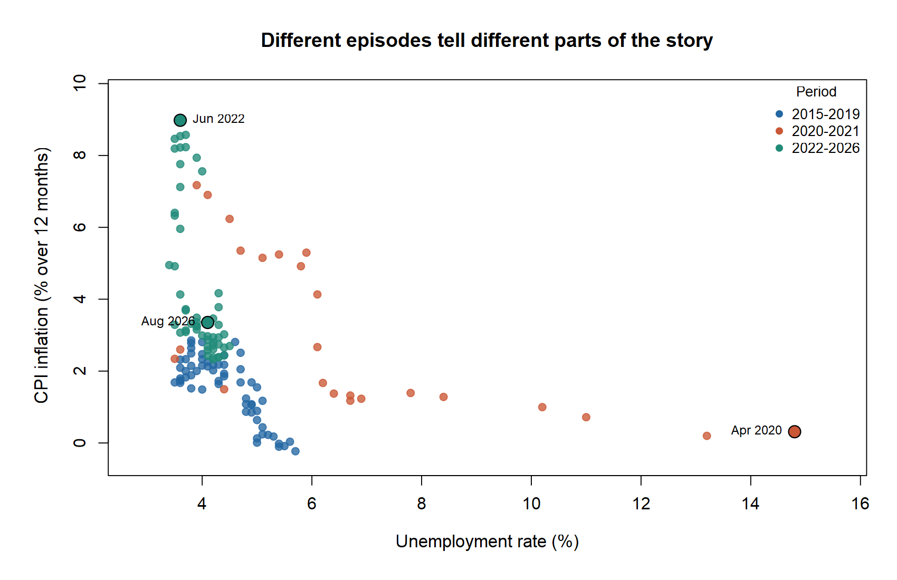
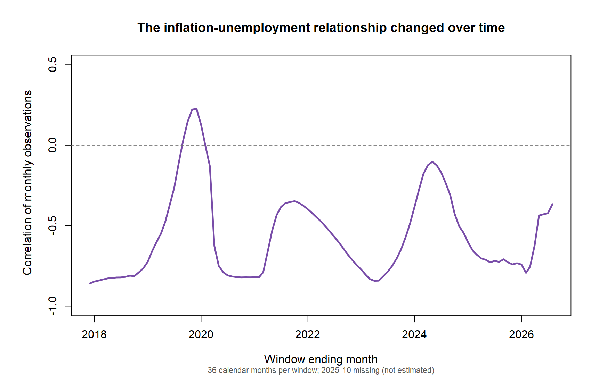

<style>
main.content {
  font-family: Arial, Helvetica, sans-serif;
  font-size: 17px;
  line-height: 1.8;
}
h1.title {
  font-size: 2.2rem;
  line-height: 1.25;
}
main.content h2 {
  font-size: 1.55rem;
  margin-top: 2rem;
  margin-bottom: 0.8rem;
}
main.content p {
  margin-bottom: 1.1rem;
  text-align: justify;
  text-justify: inter-word;
}
.quarto-figure {
  margin-top: 1.5rem;
  margin-bottom: 1.5rem;
}
figcaption {
  font-size: 0.9rem;
  line-height: 1.5;
}
</style>

```{r}
#| include: false
# Rebuild the cleaned data, tables, and three figures from the committed FRED
# snapshots each time this post is rendered. No network access is needed here.
source("code/01_analyze.R", local = TRUE)
monthly <- read.csv("data/cleaned/monthly_inflation_unemployment.csv")
facts <- read.csv("results/tables/key_facts.csv")
periods <- read.csv("results/tables/period_summary.csv")
fact <- function(metric) {
  v <- facts$value[facts$metric == metric]
  stopifnot(length(v) == 1L, is.finite(v))
  v
}
stopifnot(nrow(monthly) == 140L, nrow(periods) == 3L,
          fact("complete_months") == 139L,
          identical(as.character(tail(monthly$date, 1)), "2026-08-01"))
```

## Dual pressures at work in the U.S. economy

Inflation makes everyday purchases more expensive; unemployment means people who want work cannot find it. A familiar economic idea suggests that the two can sometimes move in opposite directions. Did they actually do so in the United States during the past decade, including the pandemic and its aftermath? The answer matters because a single story about an inflation–unemployment tradeoff could miss very different episodes.

## Data and method

I use monthly U.S. unemployment rates and the Consumer Price Index (CPI) from January 2015 through August 2026. Both series are seasonally adjusted. The CPI is a **price level**, so let us calculate inflation as its percentage change from the same month one year earlier: `(CPI this month / CPI 12 months ago − 1) × 100`. The unemployment series is already a percentage rate. Observations are matched by month.

Observations for October 2025 are missing for both series and are omitted from the analysis. (The U.S. Bureau of Labor Statistics (BLS) explains that the 2025 federal shutdown interrupted collection of these data.)

## 1. What changed over time?



The timing matters. Unemployment jumped to `r sprintf("%.1f", fact("peak_unemployment"))`% in April 2020, when CPI inflation was low. Inflation peaked much later, at `r sprintf("%.1f", fact("peak_inflation"))`% in June 2022, when unemployment had fallen. By August 2026, inflation was `r sprintf("%.1f", fact("latest_inflation"))`% and unemployment was `r sprintf("%.1f", fact("latest_unemployment"))`%. The panels use separate vertical scales, so compare the dates and directions, not the visual height of one line against the other.

## 2. What did individual months look like?



Each point is one month. Points toward the right had higher unemployment; points near the top had higher inflation. April 2020 sits far to the right, while June 2022 sits near the top. The colored clusters show that the post-2021 inflation episode occurred mostly at lower unemployment rates than the first pandemic shock. The full-sample correlation is `r sprintf("%.2f", fact("overall_correlation"))`, but that one number blends episodes with very different economic conditions. A negative correlation describes how these observed monthly pairs lined up; it does not show that reducing unemployment *caused* prices to rise.

## 3. Was the relationship stable?



The third chart recalculates the correlation using the preceding 36 calendar months at each point. It was strongly negative in some windows, briefly positive around 2019, and negative again later. Windows covering October 2025 use the 35 available monthly pairs; no value is filled in. This movement warns against treating one historical correlation as a permanent economic rule. Inflation and unemployment can both respond to disruptions, policy, and other forces that require further exploration.

## Takeaway

From 2015 through August 2026, inflation and unemployment often moved in opposite directions, but the relationship changed across episodes. In particular, the unemployment spike of 2020 preceded the inflation peak of 2022 by more than two years. The useful lesson is to examine **both timing and economic context** before drawing conclusions from their overall correlation. These figures are descriptive and do not establish a causal tradeoff or predict what will happen next.

## Data Sources

- [Consumer Price Index for All Urban Consumers: All Items (CPIAUCSL)](https://fred.stlouisfed.org/series/CPIAUCSL). U.S. Bureau of Labor Statistics; monthly, seasonally adjusted. Retrieved through FRED, Federal Reserve Bank of St. Louis, September 28, 2026.
- [Unemployment Rate (UNRATE)](https://fred.stlouisfed.org/series/UNRATE). U.S. Bureau of Labor Statistics; monthly, seasonally adjusted. Retrieved through FRED, Federal Reserve Bank of St. Louis, September 28, 2026.

<details markdown="1">
<summary>October 2025 data notice</summary>

The 2025 federal government shutdown interrupted data collection. BLS explains the [October 2025 CPI gap](https://www.bls.gov/cpi/additional-resources/2025-federal-government-shutdown-impact-cpi.htm) and the [missing household-survey estimates](https://www.bls.gov/cps/methods/2025-federal-government-shutdown-impact-cps.htm). The analysis omits this month rather than filling in values.

</details>