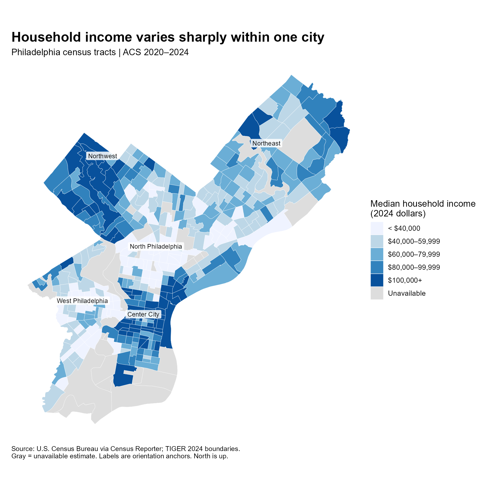
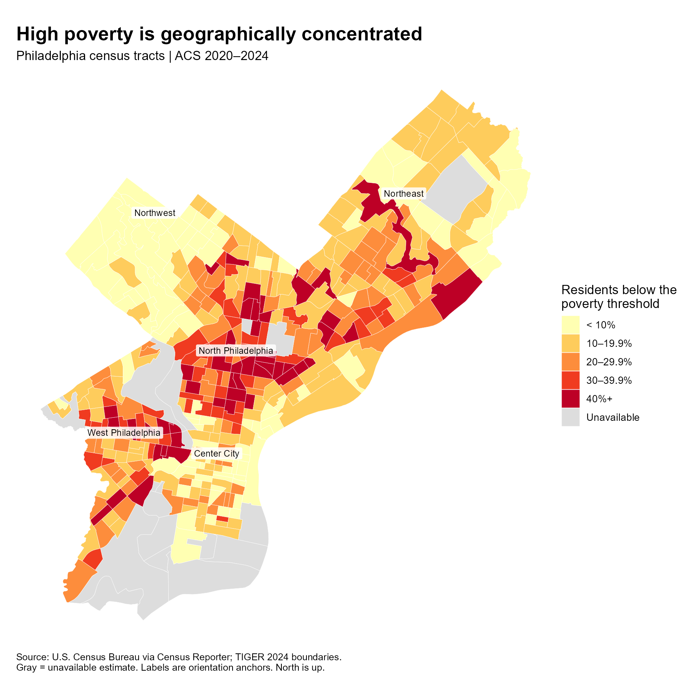
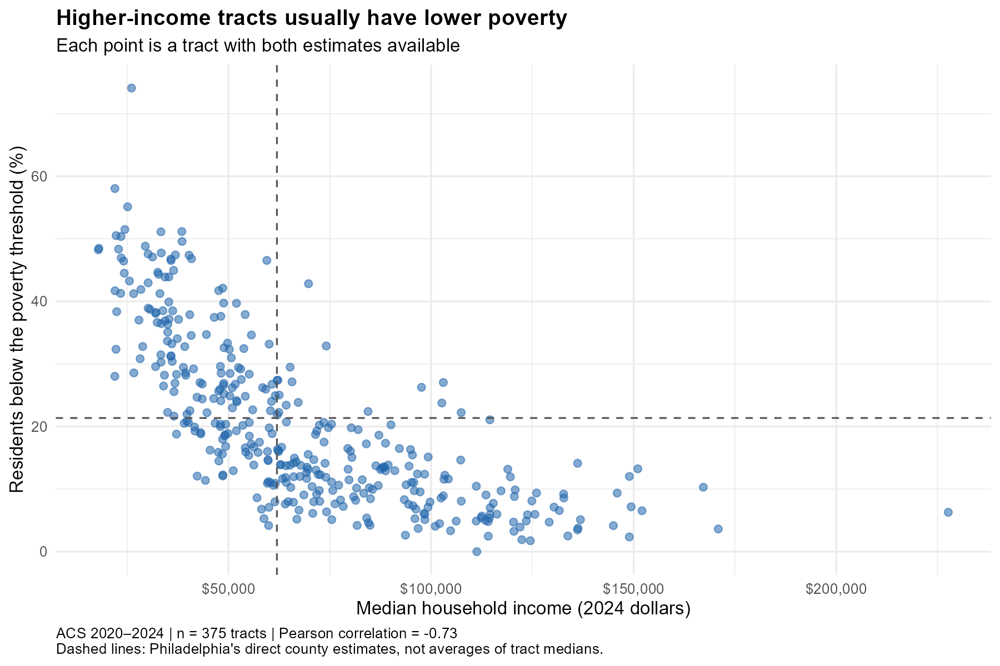

<style>
main.content {font-family: Arial, Helvetica, sans-serif; font-size: 17px; line-height: 1.8;}
h1.title {font-size: 2.2rem; line-height: 1.25;}
main.content h2 {font-size: 1.55rem; margin-top: 2rem; margin-bottom: .8rem;}
main.content p {margin-bottom: 1.1rem; text-align: justify; text-justify: inter-word;}
.quarto-figure {margin-top: 1.5rem; margin-bottom: 1.5rem;}
figcaption {font-size: .9rem; line-height: 1.5;}
</style>

```{r}
#| include: false
source("code/01_analyze.R", local = TRUE)
f <- read.csv("results/tables/key_facts.csv")
fact <- function(key) {
  z <- f$value[f$metric == key]
  stopifnot(length(z) == 1, is.finite(z))
  z
}
dollars <- function(x) paste0("$", format(round(x), big.mark = ",", trim = TRUE))
```

## What does a citywide number hide?

Philadelphia's median household income is `r dollars(fact("city_income"))`, and `r sprintf("%.1f", fact("city_poverty"))`% of residents whose poverty status is determined live below the poverty threshold. These citywide estimates offer a useful starting point, but they cannot show where economic hardship is concentrated. **How do income and poverty vary across Philadelphia, and what do their locations reveal?** The question matters because citywide measures can conceal very different local needs.

## Reading the evidence

The analysis combines the American Community Survey's **2020–2024 five-year estimates** with 2024 census-tract boundaries. Census tracts are small statistical areas, not exact neighborhood boundaries. Income is median household income in 2024 inflation-adjusted dollars. Poverty is the number of people below the poverty threshold divided by the population for whom poverty status is determined, multiplied by 100. The income measure describes households; the poverty measure describes people.

The maps cover `r fact("tracts")` tracts. Income is available for `r fact("income_available")`, poverty for `r fact("poverty_available")`, and both measures for `r fact("complete_tracts")`. Gray areas have unavailable estimates, not zero income or zero poverty. Fixed dollar and percentage categories make the legends interpretable. Labels help with orientation and do not define neighborhood boundaries.

## 1. Income follows a geography



Higher-income tracts cluster around Center City and parts of the northwest, while many lower-income tracts lie across North and West Philadelphia. Neither side is uniform: nearby tracts can occupy different income categories. Among tracts with available estimates, the 10th and 90th percentiles are approximately `r dollars(fact("income_p10"))` and `r dollars(fact("income_p90"))`. These are percentiles of **tract medians**, not percentiles of individual household incomes.

This geography suggests that economic conditions extend across groups of neighboring areas rather than being evenly distributed throughout the city. It also warns against treating a broad neighborhood label as a complete description of everyone living there.

## 2. Poverty reveals concentrated hardship



The poverty map shows a broad concentration of high rates across North Philadelphia and several parts of West Philadelphia. Many tracts around Center City and the northwest have lower rates, although important exceptions remain. Of the tracts with available poverty estimates, `r fact("poverty_ge30")` have rates of at least 30%, while `r fact("poverty_lt10")` have rates below 10%.

Such clustering matters for decisions about service locations and outreach: neighboring communities may face overlapping needs. However, a rate measures the **share** experiencing poverty, not the number of people needing assistance. Large polygons also do not necessarily contain more residents. Resource allocation should therefore combine these maps with population counts, service access, and local knowledge.

## 3. Related measures, different meanings



The scatterplot connects the two maps. Across the `r fact("complete_tracts")` tracts with both estimates, their correlation is `r sprintf("%.2f", fact("correlation"))`: higher-income tracts generally have lower poverty. The remaining spread shows why income alone is an incomplete guide to hardship. A household median summarizes the middle of a distribution; poverty counts people below thresholds that vary with family circumstances. Each point receives equal weight, so this is a relationship between tracts, not a person-level relationship.

## Takeaway and limits

Philadelphia's economic inequality has a visible spatial dimension: hardship is concentrated in some parts of the city, while higher-income areas form other clusters. These maps can guide further investigation and targeted outreach. They do not establish causes or justify judging individuals by where they live. ACS estimates have sampling uncertainty; saved margins of error accompany the underlying data, and apparent differences are not tested for statistical significance here. Five-year estimates summarize a period rather than conditions on one date. The central lesson is to look beneath citywide numbers while respecting uncertainty and variation within each tract.

## Data Sources

- [ACS 2024 five-year table B19013](https://api.census.gov/data/2024/acs/acs5/groups/B19013.html), U.S. Census Bureau: median household income in 2024 dollars.
- [ACS 2024 five-year table B17001](https://api.census.gov/data/2024/acs/acs5/groups/B17001.html), U.S. Census Bureau: poverty-status counts.
- [Census Reporter API](https://github.com/censusreporter/census-api/blob/master/API.md): access to Census Bureau income and poverty estimates and TIGER 2024 census-tract boundaries. Data retrieved October 6, 2026.
